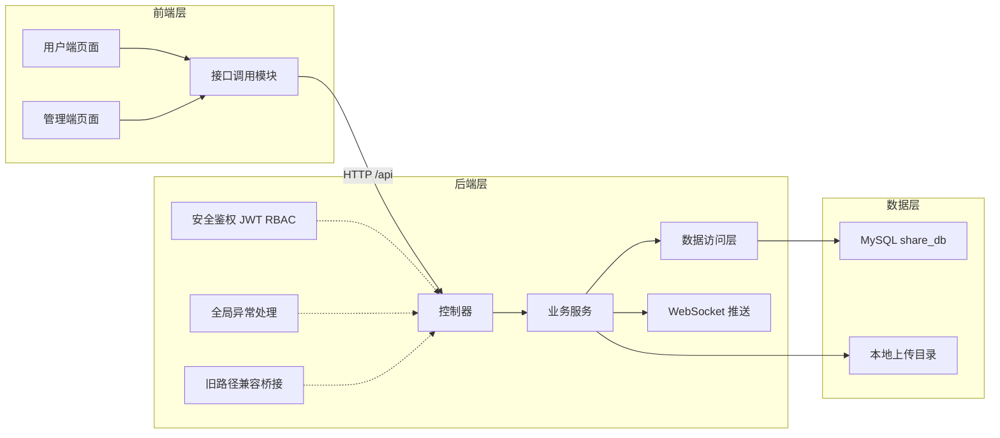
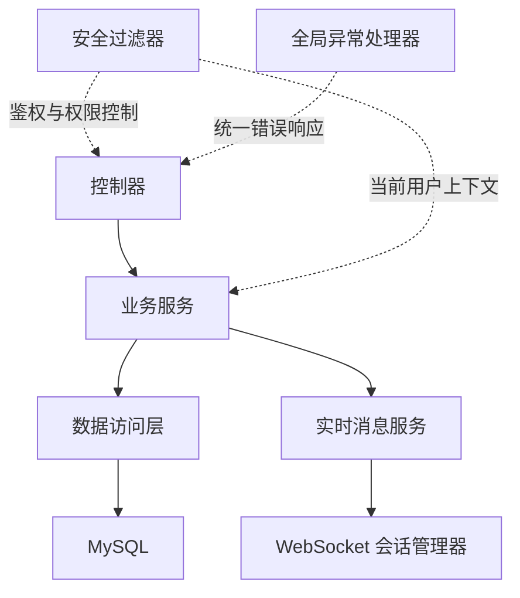
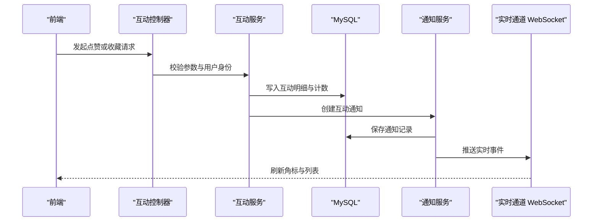
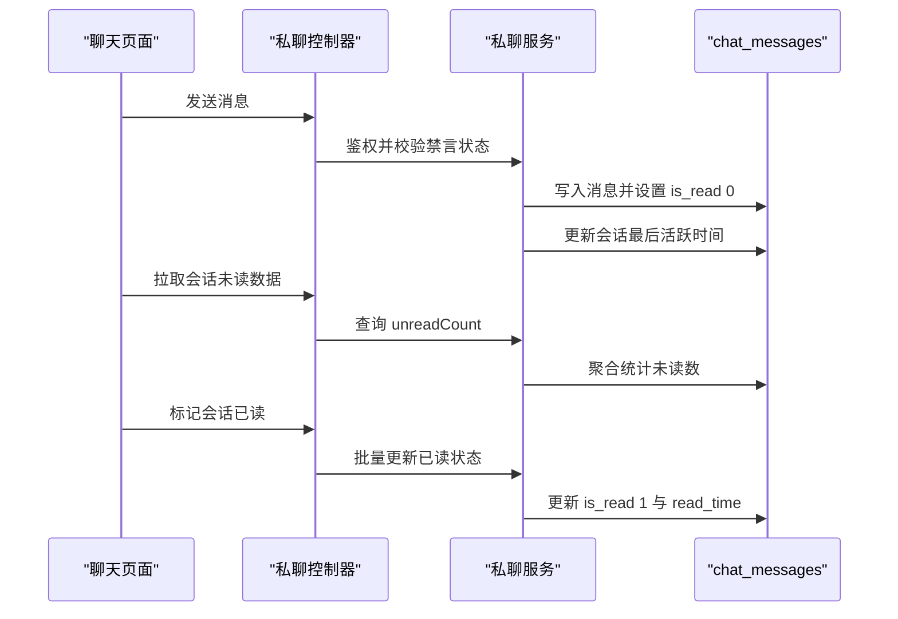
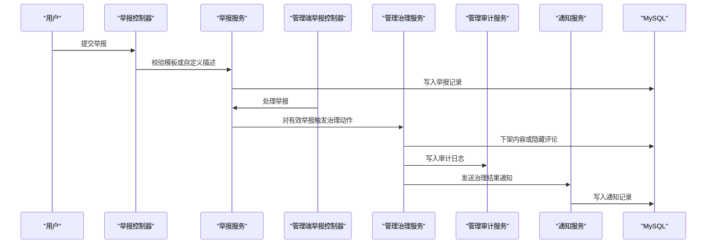
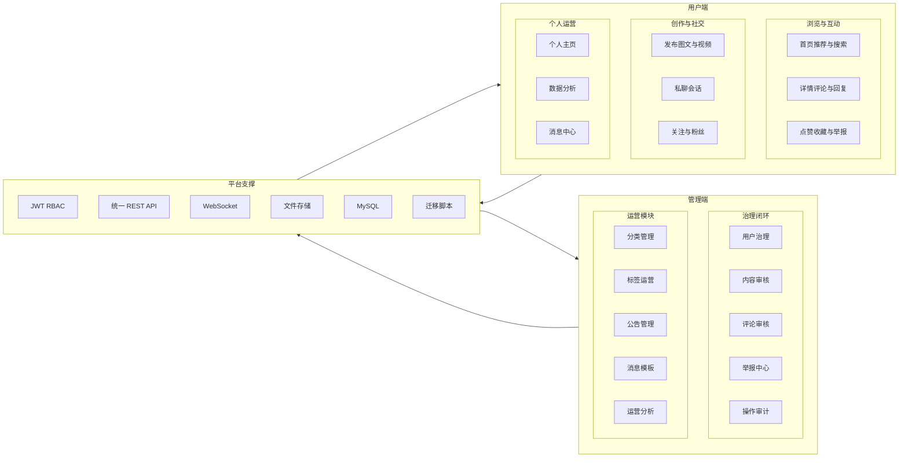
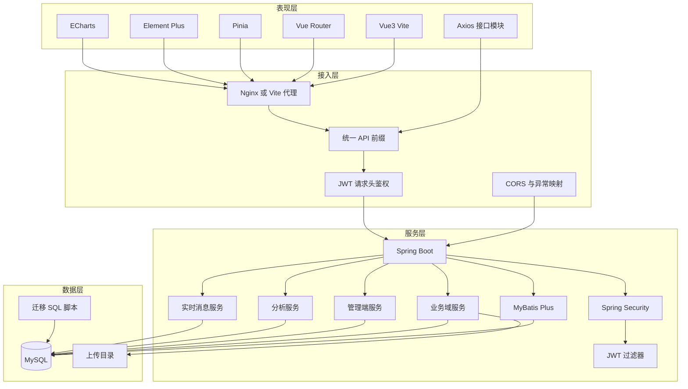

# 项目架构说明（Life Share）

## 1. 目标与范围
- 本文档用于说明当前项目的整体技术架构、模块职责、核心数据流与扩展点。
- 适用对象：二次开发工程师、运维同学、测试同学、管理端功能维护者。
- 当前版本特征：前后端分离、JWT 无状态鉴权、MySQL 单库、文件本地存储、WebSocket 实时通知。

## 2. 技术栈
- 前端：Vue 3 + Vite + Vue Router + Element Plus + ECharts + Axios。
- 后端：Spring Boot + Spring Security + MyBatis-Plus + MySQL。
- 实时通信：Spring WebSocket（通知与私聊实时推送）。
- 存储：
  - 结构化数据：MySQL（`share_db`）。
  - 媒体文件：本地 `backend/uploads`（头像、内容图片、视频、聊天图片）。

## 3. 系统分层

### 3.1 前端层（`frontend/src`）
- `views/`：页面级编排（用户端 + 管理端）。
- `api/`：接口封装层，统一调用后端 `/api/*`。
- `router/`：用户端与管理端路由守卫（登录态、权限态）。
- `components/`：可复用组件（头像、表情选择器等）。

职责边界：
- 页面负责状态管理与交互渲染。
- `api` 层负责请求参数与路径统一，不承载业务规则。
- 权限兜底以后端为准。

### 3.2 后端接口层（`controller`）
- 对外提供 REST API（用户域 + 管理域）。
- 仅做参数接收、登录态/权限态校验、调用服务层。
- 不承载复杂业务决策（业务规则统一在 `service` 层）。

### 3.3 后端业务层（`service/impl`）
- 实现核心业务规则与流程编排：
  - 内容发布/编辑/审核。
  - 评论、点赞、收藏。
  - 关注与粉丝统计。
  - 私聊会话与单向额度限制。
  - 互动通知与公告通知。
  - 举报闭环与管理治理动作。
  - 管理分析与用户分析看板。

### 3.4 数据访问层（`mapper`）
- 负责 CRUD 与聚合 SQL 查询。
- 统计口径在 Mapper SQL 中显式固定，便于前后端对账。

### 3.5 安全与基础设施层
- `security/`
  - `JwtAuthenticationFilter`：JWT 解析与用户注入。
  - `CurrentUserService`：统一获取当前用户。
  - `AdminAccessService`：RBAC 权限校验。
- `config/`
  - `SecurityConfig`：安全过滤链配置。
  - `GlobalExceptionHandler`：统一错误响应。
  - `WebSocketConfig`：WebSocket 通道配置。
  - `LegacyApiPathInterceptor`：旧路径兼容（`/api/api/*`）。
- `realtime/`
  - WebSocket Handler / SessionManager：推送通知事件。

### 3.6 架构图（Mermaid）

## 4. 模块划分

### 4.1 用户端业务模块
- 认证：注册、登录、登出。
- 内容：列表、详情、发布、编辑、删除、浏览计数。
- 互动：点赞、收藏、评论、回复。
- 社交：关注/取关、粉丝/关注列表。
- 私聊：会话、消息、未读、已读、单向/互关发信规则。
- 消息中心：互动通知、私聊未读、公告通知。
- 举报：举报提交、我的举报记录。
- 数据分析：个人运营分析（总览、趋势、Top、分类标签效果等）。

### 4.2 管理端业务模块
- 管理登录入口：`/admin/login`（复用 JWT）。
- 管理仪表盘：总览指标与趋势。
- 用户治理：封禁/解封、禁言/解除、风险标记。
- 内容/评论审核：下架、恢复、隐藏。
- 举报中心：分配、处理、闭环。
- 分类管理与标签运营。
- 公告管理与消息模板。
- 运营分析与操作审计。

## 5. 核心接口域（API）
- 用户域：`/api/auth/*` `/api/content/*` `/api/comment/*` `/api/like/*` `/api/collection/*` `/api/follow/*` `/api/chat/*` `/api/notifications/*` `/api/reports/*` `/api/analytics/me/*`。
- 管理域：`/api/admin/*`。
- 公告域：`/api/announcements/*`。
- 兼容域：`/api/api/*`（旧路径兼容转发）。

统一返回：
- 使用 `ApiResponse` 外壳（`code`、`message`、`data`）。
- 错误由全局异常处理器统一格式。

## 6. 核心数据模型

### 6.1 内容与互动
- `contents`：内容主体（含审核状态、图片/视频、互动计数）。
- `comments`：评论主体（含层级、审核状态、可见状态）。
- `likes`：内容点赞明细。
- `collections`：内容收藏明细。
- `content_view_events`：浏览事件明细。

### 6.2 社交与私聊
- `follows`：关注关系。
- `follow_events`：关/取关事件（用于趋势统计）。
- `chat_conversations`：会话。
- `chat_messages`：消息（含已读状态）。
- `chat_oneway_quota`：单向发信额度。

### 6.3 通知与公告
- `notifications`：互动通知。
- `announcements`：公告主体。
- `announcement_reads`：公告已读回执。
- `notification_templates`：系统消息模板。

### 6.4 管理与治理
- RBAC：`admin_roles`、`admin_permissions`、`admin_role_permissions`、`admin_user_roles`。
- 审计：`admin_audit_logs`。
- 举报：`reports`、`report_reason_templates`。
- 治理字段：`users`、`contents`、`comments` 上的状态与审核字段。

## 7. 关键业务流程（时序）

### 7.1 点赞/收藏触发通知
1. 用户发起点赞或收藏。
2. 后端写入互动明细并更新计数。
3. 后端生成通知记录（`notifications`）。
4. 通过 WebSocket 推送实时事件。
5. 前端角标与消息列表同步刷新。

### 7.2 私聊未读
1. 发送消息写入 `chat_messages`（接收方未读 +1）。
2. 会话列表返回 `unreadCount`。
3. 顶部角标由 `unread-count` 聚合接口刷新。
4. 打开会话后调用已读接口批量置 `is_read=1`。

### 7.3 举报闭环
1. 用户提交举报（可选模板 + 自定义描述）。
2. 管理端处理举报（驳回或有效处理）。
3. 有效举报可触发治理动作（例如下架内容）。
4. 治理动作写审计日志，并按模板通知相关用户。

## 8. 权限模型（RBAC）
- 角色：`SUPER_ADMIN`、`CONTENT_MODERATOR`、`USER_OPS`、`AUDITOR_READONLY`。
- 权限粒度：接口级（后端强校验）+ 菜单级/按钮级（前端展示控制）。
- 原则：前端可隐藏，后端必须兜底拒绝越权请求。

## 9. 统计口径原则
- 统计规则在后端固定，前端只渲染结果。
- 分母为 0 的比率统一返回 0，避免 `NaN/Infinity`。
- 趋势支持日/月粒度，保证与管理看板一致。
- 审核效率口径来源于审核状态与处理时间字段。

## 10. 部署与运行
- 前端：`npm run dev` / `npm run build`。
- 后端：`mvn spring-boot:run` / `mvn -DskipTests compile`。
- 数据库：MySQL，使用手工迁移脚本（`database_migration_phase*.sql`）。

## 11. 可扩展点建议
- 媒体存储：可从本地 `uploads` 迁移到对象存储（OSS/S3）。
- 通知系统：可引入消息队列削峰（当前为直写 + WebSocket）。
- 审核策略：内容可扩展为“先审后发”，评论保持实时。
- 搜索能力：可引入全文检索引擎（ES/OpenSearch）。
- 观测能力：补充链路追踪、结构化日志与慢查询告警。

## 12. 开发约束
- 统一走 `/api/*`，避免重复前缀。
- 业务规则改动必须同时更新中文注释与迁移脚本说明。
- 涉及治理动作必须写入 `admin_audit_logs`。
- 统计口径调整需先对齐前后端验收口径。

## 13. 业务架构图

## 14. 技术架构图

