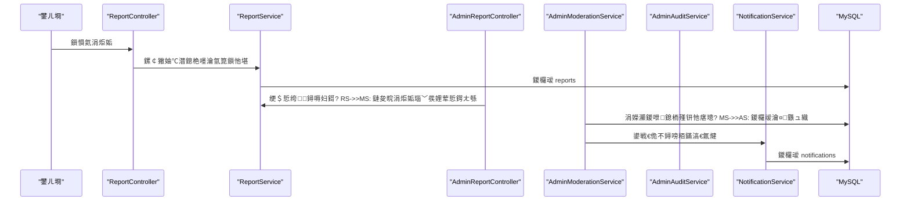
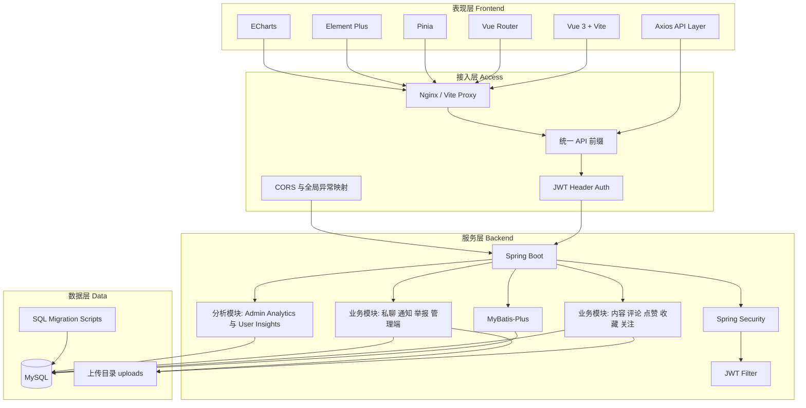

# 椤圭洰鏋舵瀯璇存槑锛圠ife Share锛?
## 1. 鐩爣涓庤寖鍥?- 鏈枃妗ｇ敤浜庤鏄庡綋鍓嶉」鐩殑鏁翠綋鎶€鏈灦鏋勩€佹ā鍧楄亴璐ｃ€佹牳蹇冩暟鎹祦涓庢墿灞曠偣銆?- 閫傜敤瀵硅薄锛氫簩娆″紑鍙戝伐绋嬪笀銆佽繍缁村悓瀛︺€佹祴璇曞悓瀛︺€佺鐞嗙鍔熻兘缁存姢鑰呫€?- 褰撳墠鐗堟湰鐗瑰緛锛氬墠鍚庣鍒嗙銆丣WT 鏃犵姸鎬侀壌鏉冦€丮ySQL 鍗曞簱銆佹枃浠舵湰鍦板瓨鍌ㄣ€乄ebSocket 瀹炴椂閫氱煡銆?
## 2. 鎶€鏈爤
- 鍓嶇锛歏ue 3 + Vite + Vue Router + Element Plus + ECharts + Axios
- 鍚庣锛歋pring Boot + Spring Security + MyBatis-Plus + MySQL
- 瀹炴椂閫氫俊锛歋pring WebSocket锛堥€氱煡/绉佽亰瀹炴椂鎺ㄩ€侊級
- 瀛樺偍锛?  - 缁撴瀯鍖栨暟鎹細MySQL锛坄share_db`锛?  - 濯掍綋鏂囦欢锛氭湰鍦?`backend/uploads`锛堝ご鍍忋€佸唴瀹瑰浘鐗?瑙嗛銆佽亰澶╁浘鐗囷級

## 3. 绯荤粺鍒嗗眰

### 3.1 鍓嶇灞傦紙`frontend/src`锛?- `views/`锛氶〉闈㈢骇缂栨帓锛堢敤鎴风 + 绠＄悊绔級
- `api/`锛氭帴鍙ｅ皝瑁呭眰锛岀粺涓€璋冪敤鍚庣 `/api/*`
- `router/`锛氱敤鎴风涓庣鐞嗙璺敱瀹堝崼锛堢櫥褰曟€併€佹潈闄愭€侊級
- `components/`锛氬彲澶嶇敤缁勪欢锛堝ご鍍忋€佽〃鎯呴€夋嫨鍣ㄧ瓑锛?
鑱岃矗杈圭晫锛?- 椤甸潰璐熻矗鐘舵€佺鐞嗕笌浜や簰娓叉煋
- `api` 灞傝礋璐ｈ姹傚弬鏁颁笌璺緞缁熶竴锛屼笉鎵胯浇涓氬姟瑙勫垯
- 鏉冮檺鍏滃簳浠嶄互鍚庣涓哄噯

### 3.2 鍚庣鎺ュ彛灞傦紙`controller`锛?- 瀵瑰鎻愪緵 REST API锛堢敤鎴峰煙 + 绠＄悊鍩燂級
- 浠呭仛鍙傛暟鎺ユ敹銆佺櫥褰曟€?鏉冮檺鎬佹牎楠屻€佽皟鐢ㄦ湇鍔″眰
- 涓嶆壙杞藉鏉備笟鍔″喅绛栵紙涓氬姟瑙勫垯缁熶竴鍦?`service` 灞傦級

### 3.3 鍚庣涓氬姟灞傦紙`service/impl`锛?- 瀹炵幇鏍稿績涓氬姟瑙勫垯涓庢祦绋嬬紪鎺掞細
  - 鍐呭鍙戝竷/缂栬緫/瀹℃牳
  - 璇勮銆佺偣璧炪€佹敹钘?  - 鍏虫敞銆佺矇涓濈粺璁?  - 绉佽亰浼氳瘽涓庡崟鍚戦搴﹂檺鍒?  - 浜掑姩閫氱煡涓庡叕鍛婇€氱煡
  - 涓炬姤闂幆銆佺鐞嗘不鐞嗗姩浣?  - 绠＄悊涓庣敤鎴峰垎鏋愮湅鏉?
### 3.4 鏁版嵁璁块棶灞傦紙`mapper`锛?- 璐熻矗 CRUD 涓庤仛鍚?SQL 鏌ヨ
- 缁熻鍙ｅ緞鍦?Mapper SQL 涓樉寮忓浐瀹氾紙渚夸簬鍓嶅悗绔璐︼級

### 3.5 瀹夊叏涓庡熀纭€璁炬柦灞?- `security/`
  - `JwtAuthenticationFilter`锛欽WT 瑙ｆ瀽涓庣敤鎴锋敞鍏?  - `CurrentUserService`锛氱粺涓€鑾峰彇褰撳墠鐢ㄦ埛
  - `AdminAccessService`锛歊BAC 鏉冮檺鏍￠獙
- `config/`
  - `SecurityConfig`锛氬畨鍏ㄨ繃婊ら摼閰嶇疆
  - `GlobalExceptionHandler`锛氱粺涓€閿欒鍝嶅簲
  - `WebSocketConfig`锛歐ebSocket 閫氶亾閰嶇疆
  - `LegacyApiPathInterceptor`锛氭棫璺緞鍏煎锛坄/api/api/*`锛?- `realtime/`
  - WebSocket Handler / SessionManager锛氭帹閫侀€氱煡浜嬩欢

### 3.6 鏋舵瀯鍥撅紙Mermaid锛?
```mermaid
flowchart LR
    subgraph FE["鍓嶇灞?]
        U["鐢ㄦ埛绔〉闈?]
        A["绠＄悊绔〉闈?]
        API["鍓嶇 API 妯″潡"]
    end

    subgraph BE["鍚庣灞?]
        SEC["瀹夊叏閴存潈 JWT + RBAC"]
        CTRL["Controller"]
        SVC["Service"]
        MAP["Mapper"]
        WS["WebSocket 瀹炴椂鎺ㄩ€?]
        EX["鍏ㄥ眬寮傚父澶勭悊"]
        LEG["鏃ц矾寰勫吋瀹规嫤鎴?]
    end

    subgraph DATA["鏁版嵁灞?]
        DB["MySQL share_db"]
        FS["鏈湴鏂囦欢 uploads"]
    end

    U --> API
    A --> API
    API -->|"HTTP /api/*"| CTRL
    SEC -.-> CTRL
    CTRL --> SVC
    SVC --> MAP
    MAP --> DB
    SVC --> FS
    SVC --> WS
    EX -.-> CTRL
    LEG -.-> CTRL
```

```mermaid
flowchart TB
    C["Controller 灞?] --> S["Service 灞?]
    S --> M["Mapper 灞?]
    M --> D["MySQL"]

    SEC["Security 杩囨护閾?] -.閴存潈涓庢潈闄?-> C
    SEC -.褰撳墠鐢ㄦ埛涓婁笅鏂?-> S

    EX["GlobalExceptionHandler"] -.缁熶竴閿欒澶栧３.-> C

    S --> RT["RealtimeMessageService"]
    RT --> W["WebSocket SessionManager"]
```

## 4. 妯″潡鍒掑垎

### 4.1 鐢ㄦ埛绔笟鍔℃ā鍧?- 璁よ瘉锛氭敞鍐屻€佺櫥褰曘€佺櫥鍑?- 鍐呭锛氬垪琛ㄣ€佽鎯呫€佸彂甯冦€佺紪杈戙€佸垹闄ゃ€佹祻瑙堣鏁?- 浜掑姩锛氱偣璧炪€佹敹钘忋€佽瘎璁恒€佸洖澶?- 绀句氦锛氬叧娉?鍙栧叧銆佺矇涓?鍏虫敞鍒楄〃
- 绉佽亰锛氫細璇濄€佹秷鎭€佹湭璇汇€佸凡璇汇€佸崟鍚?浜掑叧鍙戜俊瑙勫垯
- 娑堟伅涓績锛氫簰鍔ㄩ€氱煡 + 绉佽亰鏈 + 鍏憡娑堟伅
- 涓炬姤锛氫妇鎶ユ彁浜ゃ€佹垜鐨勪妇鎶ヨ褰?- 鏁版嵁鍒嗘瀽锛氫釜浜鸿繍钀ュ垎鏋愶紙鎬昏銆佽秼鍔裤€乀op銆佸垎绫绘爣绛炬晥鏋滅瓑锛?
### 4.2 绠＄悊绔笟鍔℃ā鍧?- 绠＄悊鐧诲綍鍏ュ彛锛歚/admin/login`锛堝鐢?JWT锛?- 绠＄悊浠〃鐩橈細鎬昏鎸囨爣涓庤秼鍔?- 鐢ㄦ埛娌荤悊锛氬皝绂?瑙ｅ皝銆佺瑷€/瑙ｉ櫎銆侀闄╂爣璁?- 鍐呭/璇勮瀹℃牳锛氫笅鏋躲€佹仮澶嶃€侀殣钘忕瓑
- 涓炬姤涓績锛氬垎閰嶃€佸鐞嗐€侀棴鐜?- 鍒嗙被绠＄悊涓庢爣绛捐繍钀?- 鍏憡绠＄悊涓庢秷鎭ā鏉?- 杩愯惀鍒嗘瀽涓庢搷浣滃璁?
## 5. 鏍稿績鎺ュ彛鍩燂紙API锛?- 鐢ㄦ埛鍩燂細`/api/auth/*` `/api/content/*` `/api/comment/*` `/api/like/*` `/api/collection/*` `/api/follow/*` `/api/chat/*` `/api/notifications/*` `/api/reports/*` `/api/analytics/me/*`
- 绠＄悊鍩燂細`/api/admin/*`
- 鍏憡鍩燂細`/api/announcements/*`
- 鍏煎鍩燂細`/api/api/*`锛堟棫璺緞鍏煎杞彂锛?
缁熶竴杩斿洖锛?- 浣跨敤 `ApiResponse` 澶栧３锛坄code`銆乣message`銆乣data`锛?- 閿欒鐢卞叏灞€寮傚父澶勭悊鍣ㄧ粺涓€鏍煎紡鍖?
## 6. 鏍稿績鏁版嵁妯″瀷

### 6.1 鍐呭涓庝簰鍔?- `contents`锛氬唴瀹逛富浣擄紙鍚鏍哥姸鎬併€佸浘鐗?瑙嗛銆佷簰鍔ㄨ鏁帮級
- `comments`锛氳瘎璁轰笌鍥炲锛堝惈瀹℃牳鐘舵€侊級
- `likes`锛氬唴瀹圭偣璧炴槑缁?- `collections`锛氬唴瀹规敹钘忔槑缁?- `content_view_events`锛氭祻瑙堜簨浠舵槑缁?
### 6.2 绀句氦涓庣鑱?- `follows`锛氬叧娉ㄥ叧绯?- `follow_events`锛氬叧娉?鍙栧叧浜嬩欢锛堢敤浜庤秼鍔跨粺璁★級
- `chat_conversations`锛氫細璇?- `chat_messages`锛氭秷鎭紙鍚凡璇荤姸鎬侊級
- `chat_oneway_quota`锛氬崟鍚戝彂淇￠搴?
### 6.3 閫氱煡涓庡叕鍛?- `notifications`锛氫簰鍔ㄩ€氱煡
- `announcements`锛氬叕鍛婁富浣?- `announcement_reads`锛氬叕鍛婂凡璇诲洖鎵?- `notification_templates`锛氱郴缁熸秷鎭ā鏉?
### 6.4 绠＄悊涓庢不鐞?- RBAC锛歚admin_roles`銆乣admin_permissions`銆乣admin_role_permissions`銆乣admin_user_roles`
- 涓炬姤锛歚reports`銆乣report_violation_templates`
- 瀹¤锛歚admin_audit_logs`

## 7. 鍏抽敭涓氬姟娴佺▼锛堟椂搴忥級

### 7.1 鐐硅禐/鏀惰棌閫氱煡
1. 鍓嶇瑙﹀彂鐐硅禐/鏀惰棌鎺ュ彛  
2. 鍚庣鍐欏叆鏄庣粏琛ㄥ苟鍚屾璁℃暟  
3. 鍚庣鐢熸垚閫氱煡璁板綍锛坄notifications`锛? 
4. 閫氳繃 WebSocket 鎺ㄩ€佸疄鏃朵簨浠? 
5. 鍓嶇瑙掓爣涓庢秷鎭垪琛ㄥ悓姝ュ埛鏂?
```mermaid
sequenceDiagram
    participant FE as "鍓嶇"
    participant C as "Like or Collection Controller"
    participant S as "Like or Collection Service"
    participant DB as "MySQL"
    participant NS as "NotificationService"
    participant WS as "WebSocket"

    FE->>C: 鐐硅禐鎴栨敹钘忚姹?    C->>S: 鍙傛暟鏍￠獙 + 鐢ㄦ埛鎬?    S->>DB: 鍐欏叆浜掑姩鏄庣粏涓庤鏁?    S->>NS: 鍒涘缓浜掑姩閫氱煡
    NS->>DB: 鍐欏叆 notifications
    NS->>WS: 鎺ㄩ€佸疄鏃朵簨浠?    WS-->>FE: 瑙掓爣涓庡垪琛ㄥ閲忓埛鏂?```

### 7.2 绉佽亰鏈
1. 鍙戦€佹秷鎭啓鍏?`chat_messages`锛堟帴鏀舵柟鏈 +1锛? 
2. 浼氳瘽鍒楄〃杩斿洖 `unreadCount`  
3. 椤堕儴瑙掓爣鐢?`unread-count` 鑱氬悎鎺ュ彛鍒锋柊  
4. 鎵撳紑浼氳瘽鍚庤皟鐢ㄥ凡璇绘帴鍙ｆ壒閲忕疆 `is_read=1`

```mermaid
sequenceDiagram
    participant FE as "鑱婂ぉ椤?
    participant C as "ChatController"
    participant S as "ChatService"
    participant DB as "chat_messages"

    FE->>C: 鍙戦€佹秷鎭?    C->>S: 閴存潈 + 绂佽█鏍￠獙
    S->>DB: 鎻掑叆娑堟伅 is_read=0
    S->>DB: 鏇存柊浼氳瘽鏈€鍚庢秷鎭椂闂?    FE->>C: 鎷夊彇浼氳瘽涓庢湭璇绘暟
    C->>S: 鏌ヨ unreadCount
    S->>DB: 鑱氬悎鏈
    FE->>C: 鎵撳紑浼氳瘽鍚庡凡璇诲洖鎵?    C->>S: 鎵归噺鏍囪宸茶
    S->>DB: 鏇存柊 is_read=1 + read_time
```

### 7.3 涓炬姤闂幆
1. 鐢ㄦ埛鎻愪氦涓炬姤锛堝彲閫夋ā鏉?鑷畾涔夋弿杩帮級  
2. 绠＄悊绔鐞嗕妇鎶ワ紙椹冲洖鎴栨湁鏁堝鐞嗭級  
3. 鏈夋晥涓炬姤鍙Е鍙戝唴瀹规不鐞嗗姩浣滐紙濡備笅鏋讹級  
4. 娌荤悊鍔ㄤ綔鍐欏璁℃棩蹇楋紝骞舵寜妯℃澘閫氱煡鐩稿叧鐢ㄦ埛



## 8. 鏉冮檺妯″瀷锛圧BAC锛?- 瑙掕壊锛歚SUPER_ADMIN`銆乣CONTENT_MODERATOR`銆乣USER_OPS`銆乣AUDITOR_READONLY`
- 鏉冮檺绮掑害锛氭帴鍙ｇ骇锛堝悗绔己鏍￠獙锛? 鑿滃崟绾?鎸夐挳绾э紙鍓嶇灞曠ず鎺у埗锛?- 鍘熷垯锛氬墠绔彲闅愯棌锛屽悗绔繀椤诲厹搴曟嫆缁濊秺鏉冭姹?
## 9. 缁熻鍙ｅ緞鍘熷垯
- 缁熻瑙勫垯鍦ㄥ悗绔浐瀹氾紝鍓嶇鍙覆鏌撶粨鏋?- 鍒嗘瘝涓?0 鐨勬瘮鐜囩粺涓€杩斿洖 0锛岄伩鍏?NaN/Infinity
- 瓒嬪娍鏀寔鏃?鏈堢矑搴︼紝淇濊瘉涓庣鐞嗙湅鏉夸竴鑷存€?- 瀹℃牳鏁堢巼鍙ｅ緞鏉ユ簮浜庡鏍哥姸鎬佷笌澶勭悊鏃堕棿瀛楁

## 10. 閮ㄧ讲涓庤繍琛?- 鍓嶇锛歚npm run dev` / `npm run build`
- 鍚庣锛歚mvn spring-boot:run` / `mvn -DskipTests compile`
- 鏁版嵁搴擄細MySQL锛屼娇鐢ㄦ墜宸ヨ縼绉昏剼鏈紙`database_migration_phase*.sql`锛?
## 11. 鍙墿灞曠偣寤鸿
- 濯掍綋瀛樺偍锛氬彲浠庢湰鍦?`uploads` 杩佺Щ鍒板璞″瓨鍌紙OSS/S3锛?- 閫氱煡绯荤粺锛氬彲寮曞叆娑堟伅闃熷垪鍓婂嘲锛堝綋鍓嶄负鐩村啓 + WebSocket锛?- 瀹℃牳绛栫暐锛氬唴瀹瑰彲鎵╁睍涓衡€滃厛瀹″悗鍙戔€濓紝璇勮淇濇寔瀹炴椂
- 鎼滅储鑳藉姏锛氬彲寮曞叆鍏ㄦ枃妫€绱㈠紩鎿庯紙ES/OpenSearch锛?- 瑙傛祴鑳藉姏锛氳ˉ鍏呴摼璺拷韪€佺粨鏋勫寲鏃ュ織涓庢參鏌ヨ鍛婅

## 12. 寮€鍙戠害鏉?- 缁熶竴璧?`/api/*`锛岄伩鍏嶉噸澶嶅墠缂€
- 涓氬姟瑙勫垯鏀瑰姩蹇呴』鍚屾椂鏇存柊涓枃娉ㄩ噴涓庤縼绉昏剼鏈鏄?- 娑夊強娌荤悊鍔ㄤ綔蹇呴』鍐欏叆 `admin_audit_logs`
- 缁熻鍙ｅ緞璋冩暣闇€鍏堝榻愬墠鍚庣楠屾敹鍙ｅ緞

## 13. 涓氬姟鏋舵瀯鍥?```mermaid
flowchart LR
    subgraph USER[鐢ㄦ埛绔痌
        subgraph U1[鍐呭娴忚涓庝簰鍔╙
            U11[棣栭〉鎺ㄨ崘/鎼滅储绛涢€塢
            U12[鍐呭璇︽儏/璇勮鍥炲]
            U13[鐐硅禐/鏀惰棌/涓炬姤]
        end

        subgraph U2[鍒涗綔涓庣ぞ浜
            U21[鍙戝竷鍥炬枃/瑙嗛]
            U22[绉佽亰浼氳瘽]
            U23[鍏虫敞/绮変笣]
        end
    
        subgraph U3[涓汉杩愯惀]
            U31[涓汉涓婚〉]
            U32[鏁版嵁鍒嗘瀽 Insights]
            U33[娑堟伅涓績]
        end
    end
    
    subgraph ADMIN[绠＄悊绔痌
        subgraph A1[娌荤悊闂幆]
            A11[鐢ㄦ埛绠＄悊]
            A12[鍐呭瀹℃牳]
            A13[璇勮瀹℃牳]
            A14[涓炬姤涓績]
            A15[鎿嶄綔瀹¤]
        end
    
        subgraph A2[杩愯惀澧炲己]
            A21[鍒嗙被绠＄悊]
            A22[鏍囩杩愯惀]
            A23[鍏憡绠＄悊]
            A24[娑堟伅妯℃澘]
            A25[杩愯惀鍒嗘瀽]
        end
    end
    
    subgraph PLATFORM[鏀拺骞冲彴]
        P1[璁よ瘉閴存潈 JWT + RBAC]
        P2[瀹炴椂閫氶亾 WebSocket]
        P3[鏂囦欢瀛樺偍 uploads]
        P4[鍏崇郴鏁版嵁搴?MySQL]
        P5[鎵嬪伐杩佺Щ鑴氭湰 database_migration_phase*.sql]
    end
    
    USER --> PLATFORM
    ADMIN --> PLATFORM
    PLATFORM --> USER
    PLATFORM --> ADMIN
```

## 14. 技术架构图

